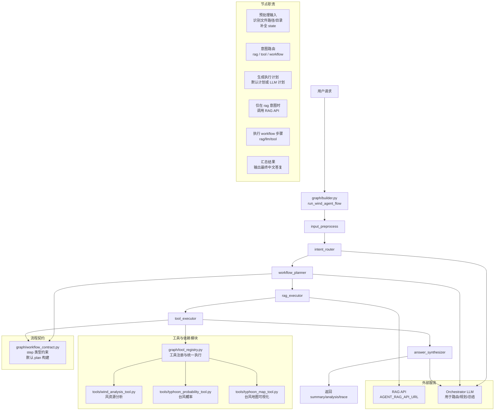

# Wind-Agent Agent 工作流（简化版）

这张图描述当前 Agent 图（LangGraph）各节点职责与模块之间协作关系。

## Agent 采用的关键技术

- `LangGraph 状态机编排`：固定节点链路（预处理 -> 路由 -> 规划 -> 执行 -> 汇总），每步读写统一 `state`。
- `LLM + Rule Hybrid Routing`：意图路由先走 LLM，再由规则护栏纠偏（如台风请求强制走 tool/workflow）。
- `Workflow Planning Contract`：执行计划使用标准 step 协议（rag/tool/llm），并带默认计划回退。
- `Deterministic Guardrails`：关键分支（台风概率/地图）使用确定性规则兜底，降低误路由。
- `Multi-step Workflow Execution`：单轮可执行混合步骤（RAG 检索、工具调用、LLM 中间总结）。
- `Tool Registry Pattern`：工具统一注册、统一输入约束与执行入口，便于扩展新工具。
- `Structured Tool Input Parsing`：从自然语言抽取台风参数（lat/lon/radius/months/year）并组装 payload。
- `Batch File Processing`：支持目录下多 Excel 文件批量执行风资源分析并聚合结果。
- `Trace & Warning 机制`：每个节点记录 trace event，保留 warning/error 便于诊断与可观测。
- `LLM Fallback Synthesis`：总结阶段支持 LLM 生成与规则兜底双路径，保证可用性。

## 一句话理解

- Agent 是一个固定 6 节点 LangGraph 流程：预处理 -> 路由 -> 规划 -> 执行 -> 汇总。
- `tool_executor` 是业务执行核心，通过 `tool_registry` 调用风资源/台风概率/台风地图工具。
- `answer_synthesizer` 统一把 RAG 结果与工具结果整理成最终回复。
