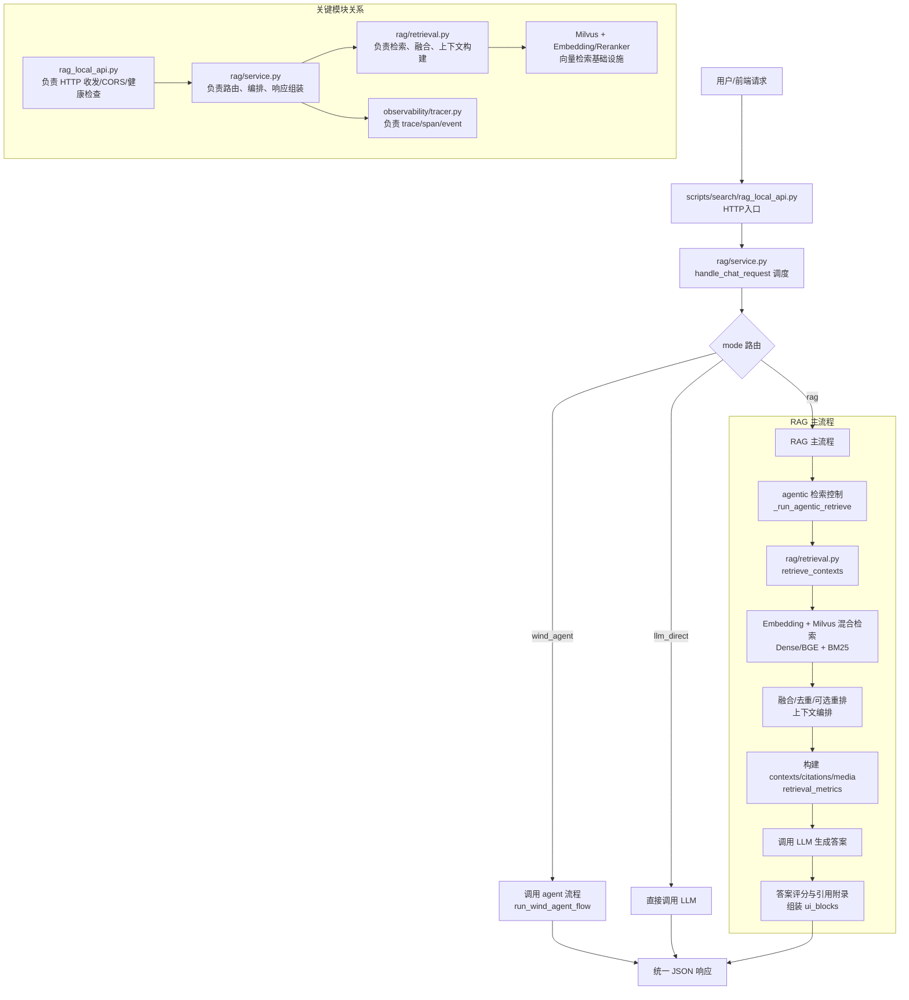

# Wind-Agent RAG 系统工作流（简化版）

这张图聚焦 RAG 主链路和模块协作关系，便于理解系统如何从请求到答案。

## RAG 采用的关键技术

- `Hybrid Retrieval`：向量检索 + 稀疏检索混合召回（Dense/BGE + BM25），并使用 RRF 融合候选。
- `Query Augmentation`：查询改写（启发式/LLM）与领域扩展（术语同义扩展），提升召回覆盖。
- `Agentic Retrieval Retry`：基于检索评分自动重试，动态调大 `top_k`、改写变体数并启用领域扩展。
- `Context Orchestration`：按问题意图（text/visual/formula）做上下文预算分配，提高提示词上下文质量。
- `Rerank + Dedup`：按文档去重、按候选重排，控制上下文噪声与冗余。
- `Grounded Answering`：答案后附 CTX 引用索引，支持 citations/media_refs/preview_images。
- `Answer Grading`：规则评分 + 可选 LLM 评分（grounding/usefulness/confidence）。
- `Compound Query Decomposition`：复杂问题拆分为子问题检索并汇总，降低单次检索失败风险。
- `Observability`：全链路 trace/span/event，便于回放与性能分析。

## 一句话理解

- `rag_local_api.py` 是入口。
- `rag/service.py` 决定走哪种模式，并在 `rag` 模式下调 `retrieve_contexts` 做检索增强。
- `rag/retrieval.py` 负责把“查询”变成“高质量上下文”，最后再由 LLM 生成可引用答案。
